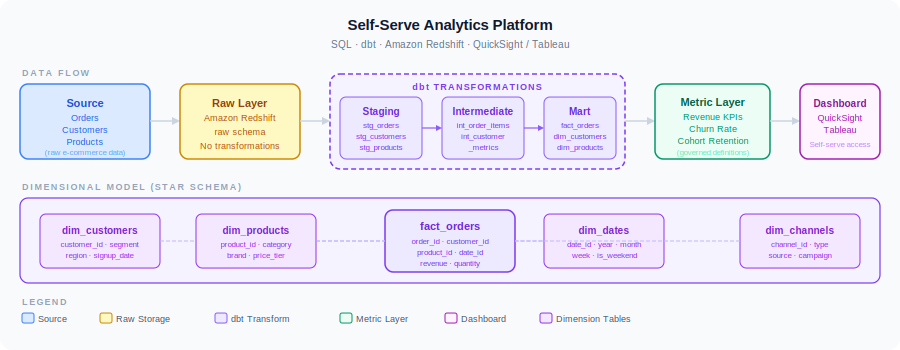

# E-Commerce Analytics Platform

End-to-end analytics platform for an e-commerce dataset. Ingests from raw CSV/API sources into Redshift, runs dbt transformations (staging → intermediate → marts), and produces a QuickSight-style KPI dashboard layer. Covers the full BI stack from raw data to executive reporting.

## Architecture



Raw e-commerce data flows through Redshift into dbt's three-layer transformation model (staging → intermediate → mart), feeds a governed metric layer (revenue, churn, cohort retention), and surfaces in interactive QuickSight/Tableau dashboards. Star schema centers on `fact_orders` with dimension tables for customers, products, dates, and channels.

```
Raw Sources (CSV / S3)
         │
         ▼
  Ingestion Layer (Python + boto3)
  → Redshift raw schema
         │
         ▼
  dbt Transformation
  ├── staging/       → clean & cast raw tables
  ├── intermediate/  → session stitching, revenue attribution
  └── marts/         → fct_orders, fct_sessions, dim_customers, dim_products
         │
         ▼
  Analytics Layer
  └── dashboards/    → KPI definitions, sample QuickSight SPICE config
```

## Tech Stack

| Layer | Tool |
|-------|------|
| Storage | Amazon Redshift / PostgreSQL (local) |
| Orchestration | Apache Airflow |
| Transformation | dbt + dbt_utils |
| Ingestion | Python, boto3, pandas |
| BI Layer | Amazon QuickSight (config) |
| CI | GitHub Actions |

## Project Structure

```
ecommerce-analytics-platform/
├── ingestion/
│   ├── load_orders.py          # Loads orders CSV → Redshift raw schema
│   └── load_customers.py       # Loads customers CSV → Redshift raw schema
├── dbt_project/
│   ├── dbt_project.yml
│   ├── packages.yml
│   ├── profiles.yml
│   └── models/
│       ├── staging/
│       │   ├── stg_orders.sql
│       │   ├── stg_customers.sql
│       │   └── stg_products.sql
│       ├── intermediate/
│       │   ├── int_orders_enriched.sql
│       │   └── int_customer_lifetime.sql
│       └── marts/
│           ├── fct_orders.sql
│           ├── dim_customers.sql
│           └── dim_products.sql
├── dashboards/
│   └── kpi_definitions.md      # KPI definitions for QuickSight
├── .github/workflows/
│   └── ci.yml
└── requirements.txt
```

## Key Metrics Produced

| KPI | Model | Description |
|-----|-------|-------------|
| GMV | fct_orders | Gross merchandise value by day/week/month |
| AOV | fct_orders | Average order value |
| Customer LTV | dim_customers | Revenue per customer over lifetime |
| Repeat Rate | dim_customers | % customers with > 1 order |
| Top Products | fct_orders + dim_products | Revenue by SKU |
| Refund Rate | fct_orders | % orders refunded |

## Usage

```bash
# 1. Load raw data
python ingestion/load_orders.py --source data/orders.csv --connection $REDSHIFT_CONN

# 2. Run dbt transformations
cd dbt_project
dbt deps
dbt run
dbt test

# 3. Verify marts
dbt run --select marts
```
